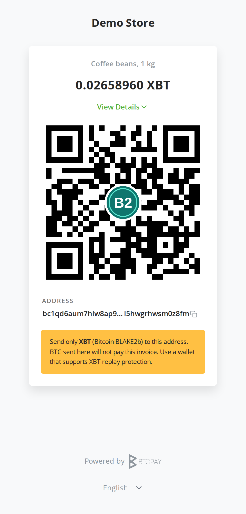
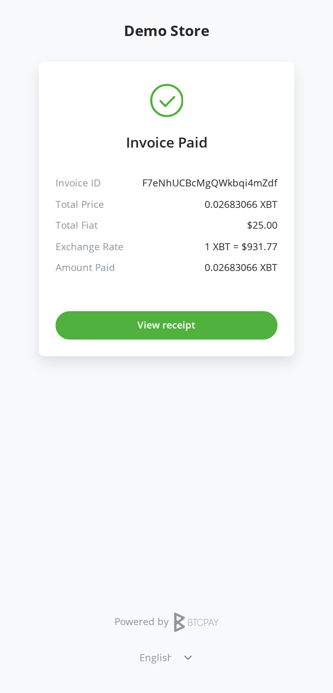
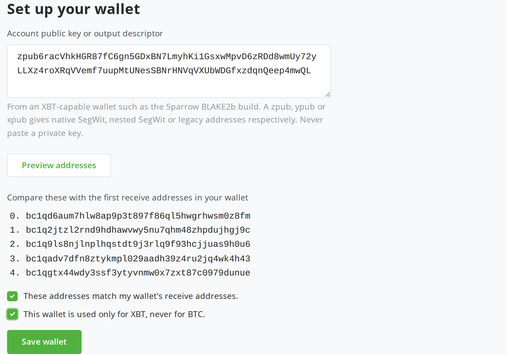
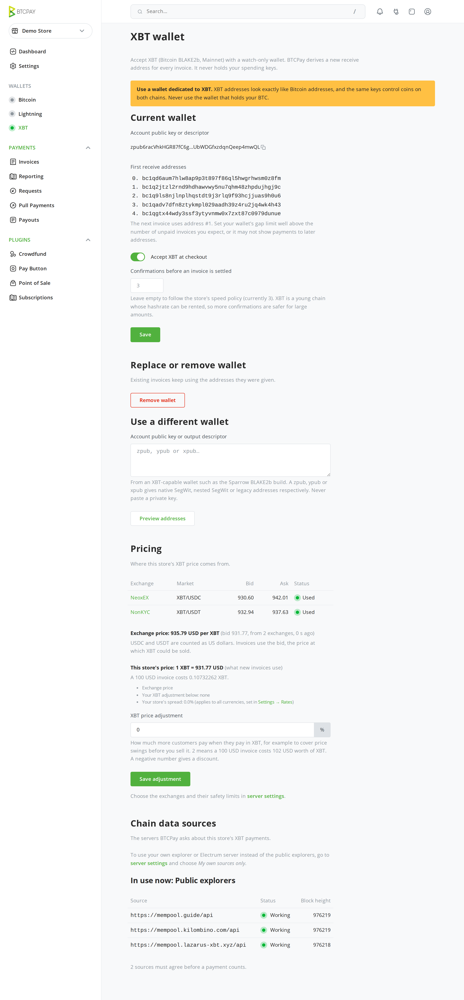
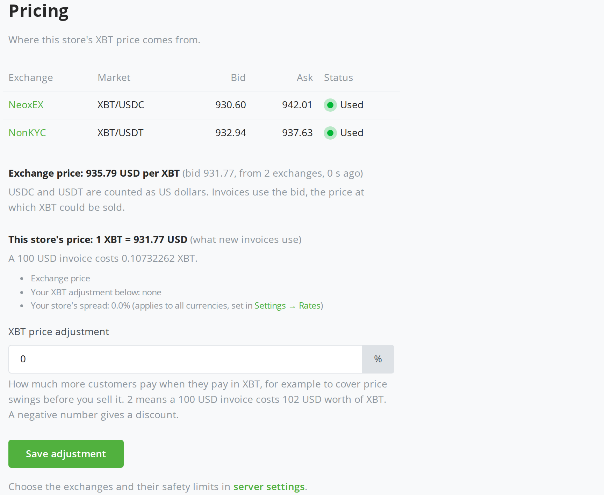
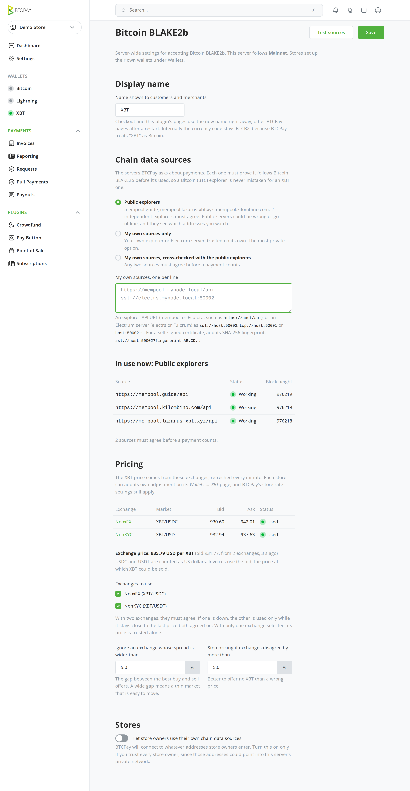

# Bitcoin BLAKE2b (XBT) for BTCPay Server

Accept **Bitcoin BLAKE2b (XBT)** payments in your BTCPay Server store, without running an XBT node.

<p>
  
  &nbsp;
  
</p>

**Status: beta (v0.1.0).** It has been verified with a real mainnet payment, on testnet4, and against simulated chains with reorganizations and outages. It has not been independently audited, so start with small amounts.

## What it is

XBT (also traded as BTCB2) is the chain that forked from Bitcoin at block 961,640 on August 30, 2026, when it switched to BLAKE2b proof of work. Its addresses, wallets and transactions work like Bitcoin's, but it is a separate coin on a separate chain.

This plugin adds XBT as a payment method in BTCPay Server:

- **No node needed.** Payments are detected through block explorers and Electrum servers: independent public ones by default, or your own.
- **Your keys stay with you.** You give BTCPay a watch-only key from your XBT wallet. Every invoice gets a fresh address from it, and payments go straight to your wallet.
- **Fair prices.** XBT is priced from live exchange order books, with safety checks, and you can see exactly where each price comes from.
- **Built for a young chain.** Two independent explorers must agree before a payment counts, every source must prove it follows the XBT chain and not Bitcoin, and invoices wait for more confirmations than Bitcoin's defaults.

Not included: Lightning, refunds and payouts, and spending from BTCPay. Send from your own XBT wallet.

## Before you start: use a dedicated wallet

**XBT addresses look exactly like Bitcoin addresses, and the same keys control coins on both chains.** Create a wallet used only for XBT in an XBT-capable wallet, such as the [Sparrow BLAKE2b build](https://github.com/paulscode/sparrow/releases). Never use the wallet that holds your BTC.

## Install

You need BTCPay Server **2.4.5 or later** and a server admin account.

1. Download **`BTCPayServer.Plugins.BitcoinBlake2b.btcpay`** from the [latest release](https://github.com/cwhorton/btcpayserver-blake2b-plugin/releases/latest). Keep the file name as it is: BTCPay uses it to identify the plugin.
2. In BTCPay, open *Server settings → Plugins* and click **Upload plugin**. Choose the file and upload it.
3. When BTCPay says "Files uploaded, restart server to load plugins", restart BTCPay, for example from *Server settings → Maintenance*.

A BTCPay server on mainnet accepts XBT mainnet. A testnet or regtest server follows XBT testnet4.

## Set up a store

### 1. Add your XBT wallet

Open your store and go to **Wallets → XBT**. Paste your wallet's account public key (zpub, ypub or xpub) or its output descriptor, then click **Preview addresses**. Check that the addresses match the first receive addresses in your wallet, confirm both boxes, and save.



Set your wallet's **gap limit** well above the number of unpaid invoices you expect, for example 100. Every invoice uses a new address, including invoices that are never paid, and a wallet with a small gap limit may not show payments to later addresses.

### 2. Check the store's XBT page

The same page then shows:

- your wallet's first receive addresses;
- whether XBT is offered at checkout;
- how many confirmations settle an invoice. The default follows your store's speed policy but is stricter than Bitcoin's (1, 3, 6 or 12), and you can set your own number.
- the **Pricing** of your invoices;
- the **chain data sources** that watch for your payments.



### 3. Pricing

XBT is priced from the live order books of **NeoxEX** (XBT/USDC) and **NonKYC** (XBT/USDT), with USDC and USDT counted as US dollars. The Pricing section shows each exchange's bid and ask, whether it was used (or why not), and the exact rate your invoices will use.



- **XBT price adjustment:** charge XBT payers a little more, for example +2% to cover price swings before you sell, or give a discount with a negative number.
- **Safety checks.** Thin order books (a wide gap between buy and sell offers) are ignored. If the two exchanges disagree too much, XBT is not offered rather than mispriced. When one exchange is down, the other is used only while its price stays close to the last price both agreed on.
- **Other currencies** are converted from USD with your store's usual rates, and BTCPay's store spread (*Settings → Rates*) still applies.

### 4. Your customers' checkout

Customers see the amount in XBT, a QR code, the address, and a warning not to send BTC. There is deliberately no "pay in wallet" button: a `bitcoin:` link would open a Bitcoin wallet. Once enough sources agree on the payment and it has the required confirmations, the invoice is paid (see the screenshots at the top).

## Server settings

Server admins find the plugin under **Server settings → Bitcoin BLAKE2b**:

- **Display name:** "XBT" by default.
- **Chain data sources:**
  - public explorers (default; 2 of 3 must agree);
  - your own explorers or Electrum servers only;
  - or your own sources cross-checked with the public ones.

  **Test sources** shows whether each one works and follows the XBT chain.
- **Pricing:** which exchanges to use, and the spread and disagreement limits.
- **Stores:** whether store owners may enter their own chain data sources.



### Using your own explorer or Electrum server

Your own source is the most private option: public explorers see which addresses you watch. Choose **My own sources only**, which turns the public explorers off, or **My own sources, cross-checked with the public explorers**. Then enter your sources one per line, click **Test sources**, and save.

| Source | Example |
| --- | --- |
| mempool or Esplora explorer (its API URL) | `https://mempool.mynode.local/api` |
| Electrum server with TLS | `ssl://electrs.mynode.local:50002` or `electrs.mynode.local:50002:s` |
| Electrum server without TLS (local network only) | `tcp://192.168.1.20:50001` |
| Electrum server with a self-signed certificate | `ssl://electrs.mynode.local:50002?fingerprint=AB:CD:…` (its SHA-256 fingerprint) |

Use the BLAKE2b builds of these servers, for example [electrs](https://github.com/jasonsopko/electrs), [Fulcrum](https://github.com/privkeyio/Fulcrum) or [mempool](https://github.com/Retropex/mempool); [awesome-bitcoin-blake](https://github.com/bitcoin-blake/awesome-bitcoin-blake) lists more. Any source that answers for the Bitcoin chain instead of XBT is rejected automatically.

If the admin allows it, store owners can choose their own sources on their store's XBT page. These must be on the public internet; BTCPay refuses to connect them to private or local addresses.

### Configuration for operators

| Environment variable | Purpose |
| --- | --- |
| `BTCPAY_BTCB2_CHAIN` | `mainnet` or `testnet4`, overriding the default that follows BTCPay's network |
| `BTCPAY_BTCB2_ESPLORA` | Comma-separated chain data sources. Overrides the admin page and locks it. |
| `BTCPAY_BTCB2_REQUIRED_AGREEMENT` | How many of those sources must agree (default: 2 when several are set, otherwise 1) |
| `BTCPAY_BTCB2_POLL_SECONDS` | How often pending invoices are checked (default 15) |

The internal currency code is `BTCB2`, because BTCPay Server treats `XBT` as another name for Bitcoin. Use `BTCB2` for invoices priced directly in XBT and in rate scripts. The default rate rules are:

```
BTCB2_X = BTCB2_USD * BTC_X / BTC_USD;
BTCB2_USD = btcb2(BTCB2_USD);
```

To set a store's wallet through the Greenfield API, call
`PUT /api/v1/stores/{storeId}/payment-methods/BTCB2-CHAIN` with a body of
`{"enabled": true, "config": {"walletKey": "<zpub or descriptor>", "confirmationsRequired": 3}}`.

## Risks to understand

- **Public sources are trusted parties.** They can be wrong, offline or compromised. Requiring agreement between independent operators reduces this risk without removing it. For larger amounts, run your own source.
- **A payment stops counting only on positive evidence.** Enough sources must answer and no longer report it; a silent source never counts as evidence. A confirmed payment needs every answering source to agree it is gone, over several minutes. Payments that arrive after an invoice expires are still recorded for 3 days and marked as paid late.
- **The chain is young.** Reorganizations are more likely than on Bitcoin, so raise the confirmation count for large payments.
- **Prices come from thin markets.** The plugin refuses to price when the exchanges look wrong, but check your invoices.
- **Replay protection is opt-in on XBT.** Customers should pay from an XBT wallet that uses it. The checkout warns them not to send BTC.

## Development

Everything runs in Docker. The .NET SDK, BTCPay Server and its dependencies all run in containers, and nothing is installed on the host.

```bash
git clone --recurse-submodules https://github.com/cwhorton/btcpayserver-blake2b-plugin.git
./dev.sh up            # build the plugin and start BTCPay at http://localhost:14142
./scripts/dev-seed.sh  # local admin, API key and store (credentials in the gitignored .dev.env)
./dev.sh restart       # rebuild the plugin and reload BTCPay
./dev.sh test          # unit tests (LIVE_TESTS=1 adds tests against public mainnet sources)
./dev.sh logs          # follow BTCPay's logs
./dev.sh down          # stop everything
```

BTCPay Server is pinned as a git submodule in `submodules/btcpayserver`. Run `./dev.sh` on its own to list every command.

**Testing payment detection without real coins.** `./dev.sh fake-chain` points BTCPay at three fake chain sources (two explorers and an Electrum server), and two of them must agree. Drive them with `scripts/fake-chain.sh` (`pay`, `mine`, `reorg`, `drop`, `fail`), or run the end-to-end scenarios with `python3 scripts/e2e_fake_chain.py`. Then `./dev.sh real-chain` returns to the public testnet4 sources, and `./dev.sh mainnet` follows XBT mainnet.

**Packaging.**
- `./dev.sh package` builds the release `.btcpay` file into `.build/packed`.
- `./dev.sh upload-test` installs that file into the official BTCPay image through its *Upload plugin* form and checks that it loads.
- `./dev.sh screenshots` retakes the screenshots above.

## License

MIT
